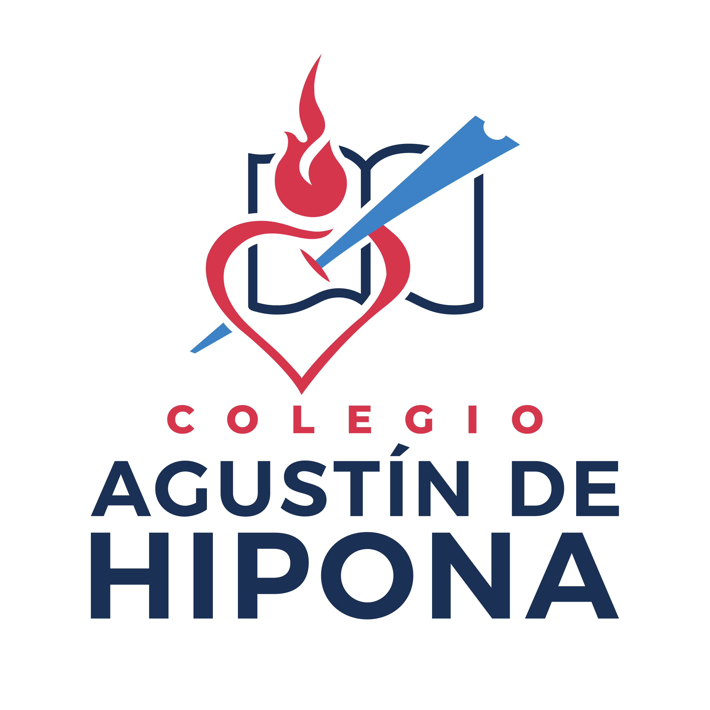

# José Manuel Cuenca Lerma

## Social Media

- LinkedIn: [José Cuenca](https://www.linkedin.com/in/josemanuelcuencalerma/)
- Email: josemanuel@lermaserver.com

## Summary

Software Developer with 5 years of professional experience working with front-end and back-end technologies with their
implementation on Cloud and inclusion of Machine Learning solutions in the architecture. Skilled in digital transformation of
startups decreasing paperwork by more than 80% and mentored collaborators to automate processes. Collaborated on high
performance teams at Globant finishing more than 90% of SCRUM tickets on time and achieving 2 professional certifications.

## Certifications

- Java SE 8 Programmer, Oracle Certified Associate
- Google Cloud Certified Associate Cloud Engineer, Google
- Software Design and Architecture, University of Alberta

## IT Skills

- Programming Languages: 
  
  
  
  
  
  

- Frameworks:

   
   
   
   
  
  

- Databases:

   
   
  
  

- Tools: 

   
   
   
   
   
  
  

## Project Demos

### El Foráneo

- Description: This is a Cloud Solution to improve the personal finances management. You will be able to track your transactions, visualize your balance and export it as a dynamic chart.
- [Demo](https://lermaserver.com/elforaneo/)

### MSG Cloud

- Description: Design and Implementation of a Materialize Web App to Manage Company Budget in Real Time achieving 100% of Software Requirements. Coached employees to digitize more than 10 company processes.
- [Demo](https://www.youtube.com/playlist?list=PLHCx0_yvx64kO9rLX8kslwjDna3Txji_8)

### AppHipona

- Description: Development of a Bootstrap Web App to Record the Academic Performance in Real Time performed 100% of Software Requirements. Led academic team of 50 members to migrate from paper to cloud.
- [Demo](https://drive.google.com/file/d/1V2RhrkHKa99H_4UPLbwBFdpBE4jSk1di/view?usp=drive_link)

## Achievements

- Veracruz 2023 State Youth Award in the Science and Technology category.
- State Acknowledgement by fostering UN Sustainable Development Goals in 2021.
- Participant in the International Project: Mountains Enchanted: The art of water springs in the Italian Alps during August 2019 in
  Italy.
- Research Stance in University of the Republic in Montevideo, Uruguay during February 2019.